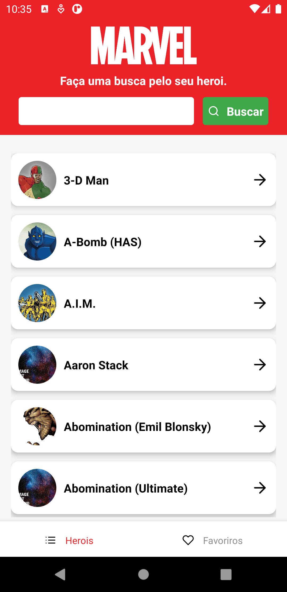
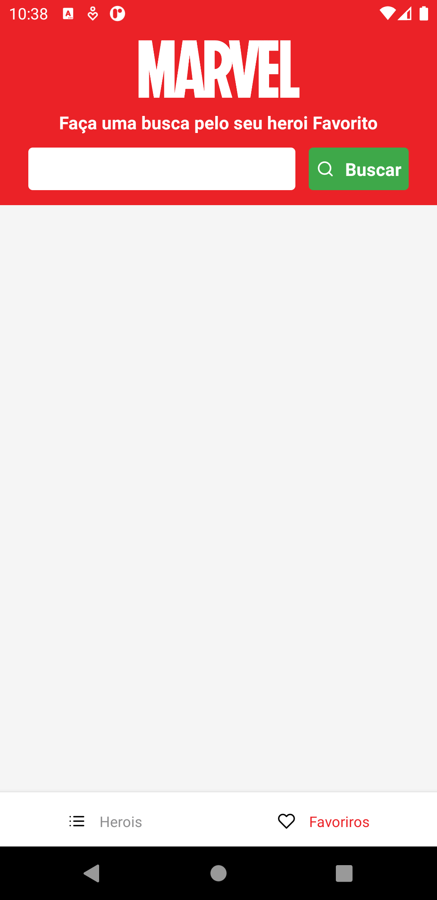
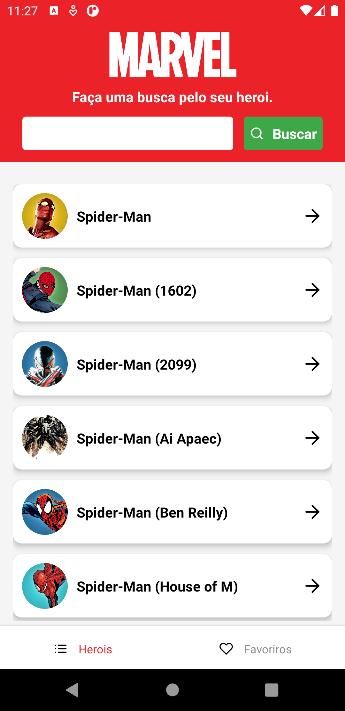
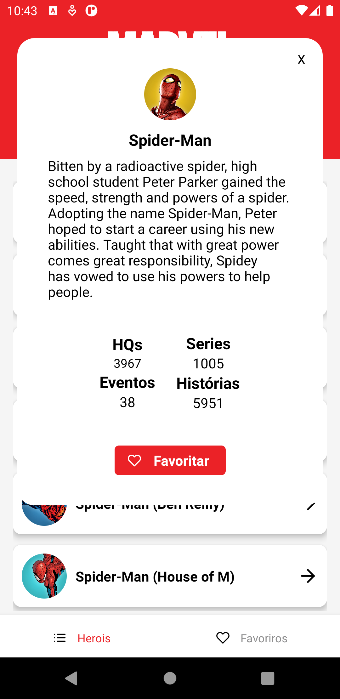
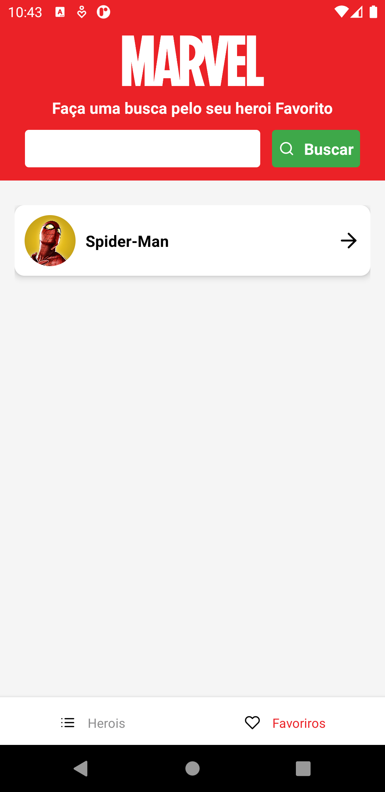
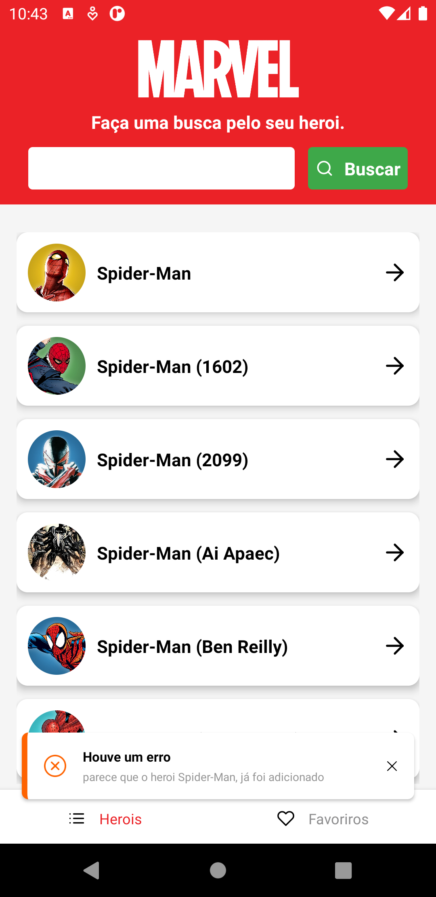
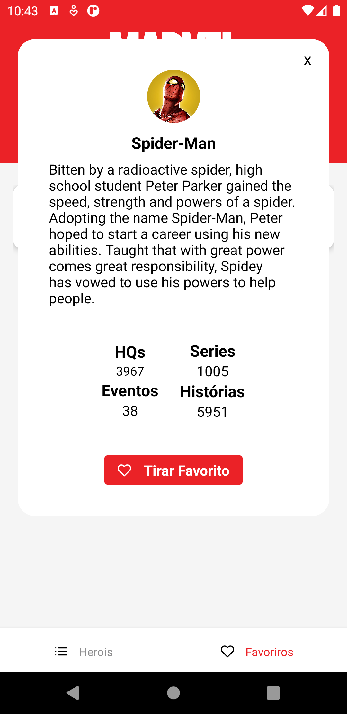

# challenge-mobile-react-native
Aplicativo para o desafio da vaga para desenvolvedor Mobile, o aplicativo foi desenvolvido e testado no Android

para executar o projeto entrar na pasta raiz e digitar o comando ```yarn``` para instalar todas as dependencias, executar um  ```yarn run android``` para executar o projeto.

<h2>Tecnologias Utilizadas</h2>
para o desenvolvimento deste aplicativo foram utilizadas as seguintes bibliotecas

- React Navigation e suas dependências para fazer as navegações entre as telas
- Redux e Redux Saga para fazer o gerenciamento das side effect
- Redux Persist para fazer a persistencia na base local
- AsyncStorage metodo utilizado para persistir localmente os heróis
- React Native Vector Icons para adicionar icones na aplicação
- React Native Toast Message para exibir toast
- Axios para realizar as chamadas a api

<h2>Navegação no App</h2>

O aplicativo contém duas telas, a principal onde é mostrada uma listagem com os herois, onde é possível fazer a busca utilizando a api da marvel
e uma tela de favoritos onde é possível fazer uma busca entre os herois que foram adicionados como favorito pelo usuário. (Ao acessar a tela de favoritos
pela primeira vez, ela ira aparecer vazia)

<p align="center">
|
</p>

<h2> Buscar Herói </h2>

Para buscar um heroi basta digitar o nome dele no input para trazer o herói desajado, ele irá filtar pelos heróis que possuem aquele nome o
<p align="center">

</p>

<h2> Favoritar um Herói </h2>

Na tela Principal ao clicar na seta que aparece ao ao lado do herói irá aparecer uma modal com os detalhes do herói, uma descrição caso ele possua,
o numero de hq, series, eventos e historias e ao final irá aparecer um botão onde é possivel favoritar esse herói.

<p align="center">

</p>

ao finalizar e ir até a tela de favoritos sera possivel ver esse heroi

<p align="center">

</p>

só é possível adicionar o heroi nos favoritos uma única vez, ao tentar adicionar mais de uma vez um toast irá aparece informando que o o herói ja foi adicionado a lista
<p align="center">

</p>

<h2> Remover um herói dos favoritos</h2>
Para remover um herói dos favoritos basta acessar a tela de favoritos e clicar na setinha para abrir novamente o modal, dessa vez o botão que aparece é o "Tirar Favorito"
<p align="center">
|
</p>
